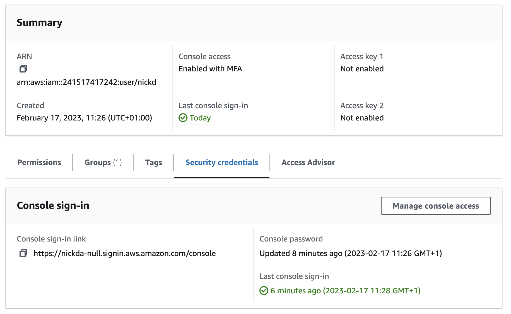

# Week 0 — Billing and Architecture

## Required Homework

### Create an Admin User with MFA enabled

### Use CloudShell

### Generate AWS Credentials

### Installed AWS CLI

### Create Budget with Notifications

### SNS Topic

### Billing Alarm

